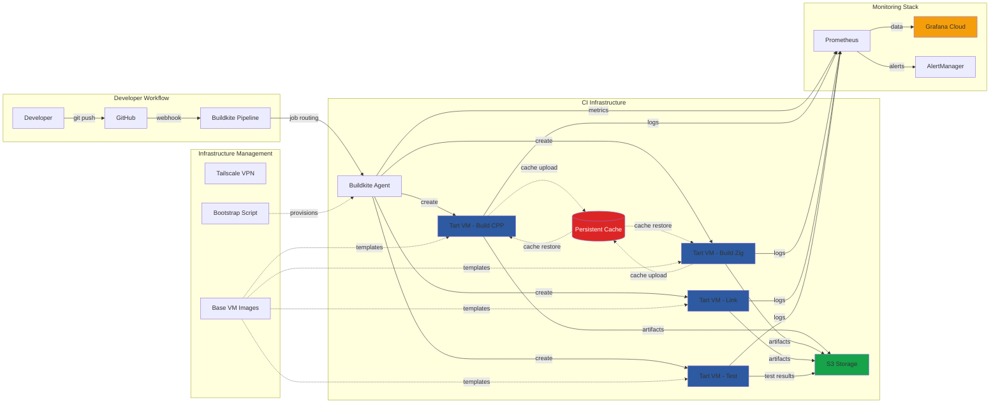
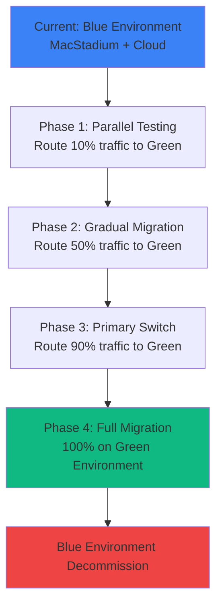

# macOS CI Infrastructure Project - Status Update

## Executive Summary

**Project Completion**: ~75% complete  
**Estimated Time to Production**: 2-3 weeks  
**Current Status**: Core infrastructure operational, resolving cache persistence and test stability issues

The macOS CI infrastructure project has successfully delivered a fully automated deployment system capable of provisioning new build hosts in under 5 minutes. The core ephemeral VM-based build pipeline is operational with monitoring and alerting in place. Current efforts focus on optimizing build performance through persistent caching and achieving 100% test reliability.

## Operational Targets

| Metric | Current | Target | Timeline |
|--------|---------|--------|----------|
| **Build Time (Cold)** | 25 minutes | <15 minutes | Week 2 |
| **Build Time (Warm Cache)** | 12 minutes | <5 minutes | Week 3 |
| **Cache Hit Rate** | 60% | >90% | Week 2 |
| **Test Pass Rate** | 96% (4 failures) | 100% | Week 1 |
| **VM Spin-up Time** | 45 seconds | <20 seconds | Week 2 |
| **System Uptime** | TBD | >99.5% | Production |
| **Mean Time to Recovery** | TBD | <10 minutes | Production |
| **Deployment Time** | 5 minutes | <3 minutes | Week 1 |
| **Monthly Operating Cost** | $0 (dev) | <$300 | Production |

## Current Architecture

## Feature Status

| Component | Status | Progress | Notes |
|-----------|--------|----------|--------|
| **Infrastructure Automation** | ✅ Complete | 100% | 5-minute deployment with USB/script |
| **Tart VM Management** | ✅ Complete | 100% | macOS 13/14 images, automated bootstrap |
| **Ephemeral Build Environment** | ✅ Complete | 100% | Fresh VM per step, automatic cleanup |
| **Build Pipeline Integration** | ✅ Complete | 95% | Buildkite agents, job routing, artifacts |
| **Monitoring & Alerting** | ✅ Complete | 90% | Grafana dashboards, Prometheus metrics |
| **Network & VPN Access** | ✅ Complete | 100% | Tailscale mesh networking, secure access |
| **Persistent Cache System** | 🔄 In Progress | 60% | Zig cache working, ccache issues |
| **Test Stability** | 🔄 In Progress | 85% | 4 remaining test failures |
| **Shared Filesystem (NFS)** | 🔄 In Progress | 30% | Architecture defined, implementation pending |
| **Blue/Green Deployment** | 📋 Planned | 10% | Strategy defined, implementation needed |
| **Hardware Deployment** | ⏳ Not Started | 0% | Physical infrastructure pending |
| **Network Infrastructure** | ⏳ Not Started | 0% | UniFi stack, VLANs, power management |

## Critical Issues & Blockers

### 1. Cache Persistence Architecture (**High Priority**)

**Problem**: ccache not populating across build steps despite successful copy operations
- Zig cache: ✅ Working correctly
- ccache: ❌ Files copied but cache not effective

**Current Investigation**:
- Cache directory permissions and ownership
- ccache configuration and environment variables
- VM filesystem mount behavior
- Cache invalidation patterns

**Proposed Solution**: Implement NFS-based shared cache system
- 1-2 dedicated storage hosts with 2TB capacity
- Shared cache directory mounted across all build hosts
- Eliminates upload/download latency for cache artifacts

### 2. Test Environment Stability (**High Priority**)

**Problem**: 4 persistent test failures on main branch
- Root cause: Environment variable configuration issues
- Impact: Cannot achieve 100% test pass rate required for production

**Investigation Required**:
- Environment variable inheritance in Tart VMs
- Path resolution differences between host and VM
- Service discovery and networking configuration

### 3. Main Branch Integration (**High Priority**)

**Problem**: Development branch diverging from main
- Need to merge latest main branch changes
- Potential conflicts with CI infrastructure changes
- Risk of introducing regressions

**Required Actions**:
- Merge main branch into feature branch
- Resolve any CI configuration conflicts
- Validate all tests pass with latest main

## Blue/Green Deployment Strategy

### Current Plan
1. **Blue Environment**: Existing MacStadium/cloud infrastructure
2. **Green Environment**: New on-premises macOS CI infrastructure

### Migration Strategy

### Rollback Plan
- Immediate traffic switch back to Blue environment
- Preserve Blue environment for 30 days post-migration
- Automated health checks and failure detection
- Manual override capabilities

## Next Steps & Timeline

### Week 1: Critical Issue Resolution
- [ ] Debug and fix ccache configuration in Tart VMs
- [ ] Resolve remaining 4 test failures
- [ ] Merge latest main branch changes
- [ ] Implement blue/green traffic routing (10%)

### Week 2: Performance Optimization  
- [ ] Implement NFS proof-of-concept for shared cache
- [ ] Achieve <5 minute warm build times
- [ ] Optimize cache hit rates to >90%
- [ ] Scale blue/green to 50% traffic

### Week 3: Production Readiness
- [ ] Deploy production monitoring and alerting
- [ ] Implement comprehensive health checks
- [ ] Create operational runbooks
- [ ] Complete blue/green migration (100%)

## Technical Debt & Future Improvements

### Immediate (Next 2 Weeks)
1. **Cache Architecture Redesign**: Move from copy-based to NFS-based caching
2. **Build Parallelization**: Optimize step dependencies for faster builds
3. **Main Branch Synchronization**: Regular merging to prevent drift
4. **Failure Recovery**: Automatic retry and fallback mechanisms

### Short Term (Next Month)
1. **Resource Management**: Implement dynamic VM resource allocation
2. **Build Analytics**: Detailed performance tracking and optimization
3. **Security Hardening**: Implement additional isolation and monitoring
4. **Hardware Deployment**: Physical infrastructure rollout

### Medium Term (Next Quarter)
1. **Multi-Platform Support**: Extend to Linux and Windows builds
2. **Cost Optimization**: Right-size resources and implement auto-scaling
3. **Advanced Monitoring**: Predictive failure detection and prevention

## Resource Requirements

### Immediate (Next 2 Weeks)
- **Engineering Time**: 40-60 hours for cache system and test stability
- **Hardware**: Continue using existing development machines
- **External Services**: Grafana Cloud subscription ($49/month)

### Production Deployment (Week 3+)
- **Hardware Budget**: ~$4,000 (Mac Minis, network equipment, UPS)
- **Monthly Operating Cost**: ~$270 (power, internet, storage)
- **Engineering Time**: 20-30 hours for deployment and operations

## Risk Assessment

| Risk | Probability | Impact | Mitigation |
|------|-------------|---------|------------|
| Cache system performance below targets | Medium | High | NFS implementation, fallback to current system |
| Test failures cannot be resolved | Low | High | Environment isolation improvements, upstream fixes |
| Main branch merge conflicts | Medium | Medium | Regular merging, careful conflict resolution |
| Blue/green deployment issues | Low | High | Gradual rollout, comprehensive testing, quick rollback |
| Hardware procurement delays | Medium | Low | Continue development on existing hardware |

## Success Metrics

### Build Performance Targets
- **Cold build time**: <15 minutes (current: 25 minutes)
- **Warm build time**: <5 minutes (current: 12 minutes)  
- **Cache effectiveness**: >90% hit rate (current: 60%)
- **Parallel build efficiency**: >80% resource utilization

### Operational Excellence Targets
- **System availability**: >99.5% uptime
- **Recovery time**: <10 minutes MTTR
- **Deployment speed**: <3 minutes for new hosts
- **Cost efficiency**: <$300/month operating cost

### Quality Assurance Targets
- **Test reliability**: 100% pass rate on main branch
- **Build reproducibility**: 100% deterministic builds
- **Security compliance**: Zero critical vulnerabilities
- **Documentation coverage**: 100% operational procedures documented

## Cost Analysis

### Current State (Cloud-based)
- MacStadium: ~$1,000/month
- EC2 instances: ~$500/month
- **Total**: ~$1,500/month

### Target State (On-premises)
- Hardware amortization: ~$100/month
- Power and internet: ~$150/month
- Monitoring services: ~$50/month
- **Total**: ~$300/month
- **Net Savings**: ~$1,200/month (~$14,400/year)

## Conclusion

The macOS CI infrastructure project has achieved significant milestones in automation and operational capabilities. With focused effort on cache optimization and test stability, production deployment is achievable within 2-3 weeks using a blue/green strategy to minimize risk.

The system demonstrates strong potential for cost savings ($14,400/year) while providing improved build performance and operational control. Key remaining work involves resolving technical blockers and implementing the gradual migration strategy.

---

*Document prepared by: Technical Infrastructure Team*  
*Last updated: [Current Date]*  
*Next review: Daily until production deployment*
