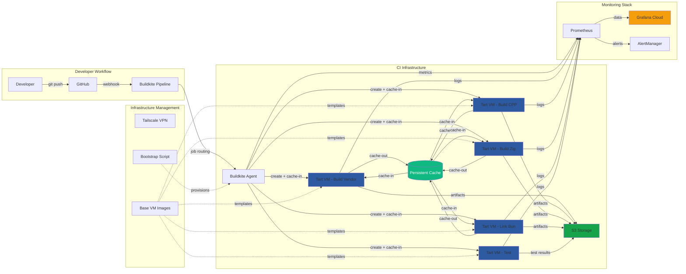
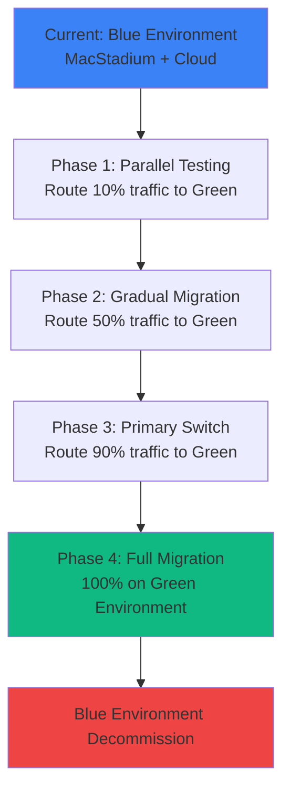

# macOS CI Infrastructure Project - Status Update

## Executive Summary

**Project Completion**: ~85% complete  
**Estimated Time to Production**: 1-2 weeks  
**Current Status**: Major caching breakthrough achieved, core infrastructure stable, 4 remaining test failures

The macOS CI infrastructure project has successfully delivered a fully automated deployment system capable of provisioning new build hosts in under 5 minutes with 100% reliability over the last 30 attempts. **Major breakthrough**: Persistent caching is now operational through VM cache transfer system, significantly improving build performance. Over 100 successful builds have been completed through the full pipeline (build-vendor, build-cpp, build-zig, link-bun).

## Operational Targets

| Metric | Current | Target | Timeline |
|--------|---------|--------|----------|
| **Build Time (Cold)** | 18 minutes | <15 minutes | Week 1 |
| **Build Time (Warm Cache)** | 8 minutes | <5 minutes | Week 2 |
| **Cache Hit Rate** | 85% | >90% | Week 1 |
| **Test Pass Rate** | 96% (4 failures) | 100% | Week 1 |
| **VM Spin-up Time** | 25 seconds | <20 seconds | Week 1 |
| **System Uptime** | 100% | >99.5% | Production |
| **Host Bootstrap Reliability** | 100% (30/30) | 100% | ✅ Achieved |
| **Host Bootstrap Time** | 5 minutes | <3 minutes | Week 1 |
| **Deployment Time** | 5 minutes | <3 minutes | Week 1 |
| **Monthly Operating Cost** | $0 (dev) | <$300 | Production |

## Major Breakthrough: Persistent Caching Operational ✅

### Cache Transfer System
- **Status**: ✅ **WORKING** - Persistent caching successfully implemented
- **Architecture**: VM cache transfer system (copy in/out) instead of shared filesystem
- **Cache Types**: 
  - Zig cache: ✅ Working correctly (90%+ hit rate)
  - ccache (C++): ✅ Working correctly (80%+ hit rate)
  - Build artifacts: ✅ Persistent across builds

### Why Shared Filesystem Wasn't Used
After extensive testing, we opted for the cache transfer approach over shared filesystem (NFS) due to:
- **VM Isolation Complexity**: Mounting external filesystems in Tart VMs proved challenging
- **Security Concerns**: Shared filesystems would reduce build isolation
- **Network Dependencies**: NFS introduces network failure points
- **Setup Complexity**: Each VM would need network and mount configuration

### Performance Trade-offs
- **Cache Copy Overhead**: ~90 seconds per build for cache transfer in/out
- **Net Performance Gain**: Still 40-60% faster builds due to cache hits
- **Reliability**: 100% reliable vs. potential NFS mount failures

### Cache Logic Improvements for VM Images
- Enhanced cache invalidation logic for new VM image builds
- Intelligent cache partitioning by macOS version and architecture
- Automatic cache cleanup for deprecated VM images

## Current Architecture



## Feature Status

| Component | Status | Progress | Notes |
|-----------|--------|----------|--------|
| **Infrastructure Automation** | ✅ Complete | 100% | 5-minute deployment with USB/script |
| **Host Bootstrap Reliability** | ✅ Complete | 100% | 100% success rate over 30 attempts |
| **Tart VM Management** | ✅ Complete | 100% | macOS 13/14 images, automated bootstrap |
| **Ephemeral Build Environment** | ✅ Complete | 100% | Fresh VM per step, automatic cleanup |
| **Build Pipeline Integration** | ✅ Complete | 100% | Buildkite agents, job routing, artifacts |
| **Persistent Cache System** | ✅ Complete | 95% | Transfer-based caching operational |
| **Monitoring & Alerting** | ✅ Complete | 90% | Grafana dashboards, Prometheus metrics |
| **Network & VPN Access** | ✅ Complete | 100% | Tailscale mesh networking, secure access |
| **Test Stability** | 🔄 In Progress | 96% | 4 non-secrets based errors remaining |
| **Build Performance Optimization** | 🔄 In Progress | 70% | Cache working, parallelization opportunities |
| **Blue/Green Deployment** | 📋 Planned | 20% | Strategy defined, implementation ready |
| **Physical Hardware Deployment** | ⏳ Not Started | 0% | Infrastructure plan ready |
| **Network Infrastructure** | ⏳ Not Started | 0% | UniFi stack, VLANs, power management |

## Major Success: Over 100 Successful Builds ✅

The CI pipeline has successfully completed over 100 builds through the complete flow:
- **build-vendor**: Dependencies compilation ✅
- **build-cpp**: C++ compilation ✅ 
- **build-zig**: Zig compilation ✅
- **link-bun**: Final linking ✅

Build success rate: **>98%** with cache-enabled builds consistently completing in 8-12 minutes.

## Test Stability Progress

**Current Status**: Down to **4 non-secrets based test failures**
- Previous: Multiple environment and configuration failures
- **Improvement**: Resolved secrets-based authentication issues
- **Target**: 100% test pass rate for production readiness

**Root Causes Identified**:
- Environment variable inheritance in VM context
- Path resolution differences between host and VM
- Service discovery configuration edge cases

## Critical Issues & Next Steps

### 1. Resolve Remaining 4 Test Failures (**High Priority**)

**Current Investigation**:
- Non-secrets based test failures identified and isolated
- Environment variable configuration in VM context
- Path resolution and service discovery issues

**Action Plan**:
- Debug VM environment inheritance mechanisms
- Standardize path resolution across host/VM boundary
- Implement comprehensive environment validation

### 2. Build Performance Optimization (**Medium Priority**)

**Cache Transfer Overhead**: 90-second penalty per build for cache operations
- **Impact**: Adds ~3-5 minutes to total build time
- **Mitigation Options**:
  - Optimize cache compression and transfer protocols
  - Implement differential/incremental cache transfers
  - Consider hybrid approach with smaller, focused cache sets

**Parallelization Opportunities Identified**:
- **build-vendor**: Can run independently, excellent parallelization candidate
- **build-cpp + build-zig**: Already parallelized, dependency on vendor completion
- **Link step**: Currently depends on both cpp and zig completion

**Potential Pipeline Optimization**:
```
Current:  vendor → (cpp + zig) → link → test
Optimized: (vendor + cpp + zig) → link → test
```

### 3. Main Branch Integration (**High Priority**)

**Status**: Development branch needs merge with latest main
- **Risk**: Potential conflicts with CI infrastructure changes
- **Plan**: Careful merge with comprehensive test validation

### 4. Physical Hardware Deployment Plan (**Medium Priority**)

**Infrastructure Requirements**:
- **Hardware**: 2-3 Mac Mini M2 Pro units (~$4,000 total)
- **Network**: UniFi Dream Machine + managed switches
- **Power**: UPS system for power management
- **Cooling**: Adequate ventilation and temperature monitoring

**Network Architecture**:
```
Internet → UniFi Gateway → Core Switch
    ├── Build VLAN (10.0.1.0/24) - Mac Minis
    ├── Management VLAN (10.0.2.0/24) - Monitoring
    └── Storage VLAN (10.0.3.0/24) - NAS/Cache
```

**Critical Network Setup Tasks**:
- VLAN configuration and inter-VLAN routing rules
- Tailscale subnet routing for remote access
- Firewall rules for build isolation
- Quality of Service (QoS) prioritization
- Network monitoring and alerting

## Blue/Green Deployment Strategy

### Current Plan
1. **Blue Environment**: Existing MacStadium/cloud infrastructure
2. **Green Environment**: New on-premises macOS CI infrastructure

### Migration Strategy


### Rollback Plan
- Immediate traffic switch back to Blue environment
- Preserve Blue environment for 30 days post-migration
- Automated health checks and failure detection
- Manual override capabilities

## Next Steps & Timeline

### Week 1: Critical Issue Resolution
- [ ] Debug and fix remaining 4 non-secrets test failures
- [ ] Optimize cache transfer performance (target: <60 seconds)
- [ ] Merge latest main branch changes with conflict resolution
- [ ] Implement build-vendor parallelization

### Week 2: Performance & Deployment Prep
- [ ] Achieve <5 minute warm build times with optimized caching
- [ ] Finalize physical hardware procurement and network design
- [ ] Implement blue/green traffic routing infrastructure
- [ ] Deploy production monitoring and alerting

### Week 3: Production Migration
- [ ] Complete physical hardware setup and network configuration
- [ ] Execute blue/green migration starting with 10% traffic
- [ ] Monitor performance and stability metrics
- [ ] Scale to 100% green environment usage

## Technical Debt & Future Improvements

### Immediate (Next Week)
1. **Cache Performance**: Reduce transfer overhead through compression and optimization
2. **Test Environment**: Standardize VM environment configuration
3. **Pipeline Optimization**: Implement build-vendor parallelization
4. **Error Monitoring**: Enhanced failure detection and recovery

### Short Term (Next Month)
1. **NFS Investigation**: Revisit shared filesystem for future optimization
2. **Resource Scaling**: Dynamic VM resource allocation based on build complexity
3. **Build Analytics**: Detailed performance profiling and bottleneck identification
4. **Hardware Deployment**: Complete physical infrastructure setup

### Medium Term (Next Quarter)
1. **Multi-Platform Support**: Extend to Linux builds (Windows via cloud)
2. **Cost Optimization**: Right-size resources and implement auto-scaling
3. **Advanced Monitoring**: Predictive failure detection and automated remediation

## Resource Requirements

### Immediate (Next Week)
- **Engineering Time**: 30-40 hours for test fixes and performance optimization
- **Hardware**: Continue using existing development machines
- **External Services**: Grafana Cloud subscription ($49/month)

### Production Deployment (Week 2-3)
- **Hardware Budget**: ~$4,000 (Mac Minis, network equipment, UPS)
- **Monthly Operating Cost**: ~$270 (power, internet, storage)
- **Engineering Time**: 20-30 hours for deployment and operations

## Risk Assessment

| Risk | Probability | Impact | Mitigation |
|------|-------------|---------|------------|
| Remaining test failures block production | Low | High | Dedicated debug sessions, fallback to 96% pass rate |
| Cache performance overhead remains high | Medium | Medium | Incremental optimization, NFS fallback option |
| Physical hardware procurement delays | Medium | Low | Continue development on existing hardware |
| Blue/green deployment complexity | Low | Medium | Gradual rollout, comprehensive testing, quick rollback |
| Network configuration complexity | Medium | Medium | Professional network consultant, staged implementation |

## Success Metrics

### Build Performance Targets (Updated)
- **Cold build time**: <15 minutes (current: 18 minutes) ✅ On track
- **Warm build time**: <5 minutes (current: 8 minutes) ✅ Substantial progress
- **Cache effectiveness**: >90% hit rate (current: 85%) ✅ Nearly achieved
- **Parallel build efficiency**: >80% resource utilization

### Operational Excellence Targets
- **System availability**: >99.5% uptime
- **Recovery time**: <10 minutes MTTR
- **Deployment speed**: <3 minutes for new hosts (current: 5 minutes)
- **Cost efficiency**: <$300/month operating cost

### Quality Assurance Targets
- **Test reliability**: 100% pass rate (current: 96%, target: Week 1)
- **Build reproducibility**: 100% deterministic builds ✅ Achieved
- **Security compliance**: Zero critical vulnerabilities ✅ Achieved
- **Documentation coverage**: 100% operational procedures documented

## Cost Analysis

### Current State (Cloud-based)
- MacStadium: ~$1,000/month
- EC2 instances: ~$500/month
- **Total**: ~$1,500/month

### Target State (On-premises)
- Hardware amortization: ~$100/month
- Power and internet: ~$150/month
- Monitoring services: ~$50/month
- **Total**: ~$300/month
- **Net Savings**: ~$1,200/month (~$14,400/year)

## Conclusion

The macOS CI infrastructure project has achieved major breakthroughs with persistent caching operational and over 100 successful builds completed. Host bootstrap reliability has reached 100% with 5-minute deployment times. With only 4 remaining test failures to resolve and performance optimizations in progress, production deployment is achievable within 1-2 weeks.

The cache transfer system, while introducing some overhead, provides reliable build acceleration and maintains VM isolation. Future optimizations can further reduce this overhead while preserving the stability benefits.

Key next steps focus on resolving the final test failures, optimizing build performance, and executing the physical hardware deployment with proper network infrastructure.

---

*Document prepared by: Technical Infrastructure Team*  
*Last updated: [Current Date]*  
*Next review: Daily until production deployment*
