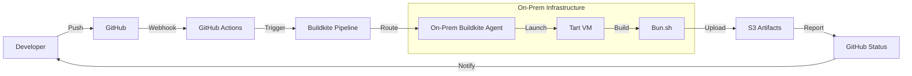

# Bun.sh On-Prem CI: Hardware and Infrastructure Design

## Overview
This is a design document for an on-prem CI rack to handle Bun.sh builds across all target platforms. The immediate goal is to reduce MacStadium and EC2 costs by bringing macOS builds in-house, with a path to expand to other platforms later.


### Technical Stack

#### Tart
Use Tart for macOS virtualization.

Rationale:
- It's the only virtualization solution that works natively on Apple Silicon
- Provides clean, reproducible build environments
- Allows us to run multiple isolated builds simultaneously
- Enables us to maintain a library of pre-configured build environments

#### Buildkite
Use Buildkite for self hosted CI agents and artifact storage.

Rationale:
- Gives us full control over the build environment
- Allows us to run builds on our own hardware
- Provides flexible job routing based on hardware capabilities
- Enables us to scale horizontally as we add more build hosts

#### Terraform
Use Terraform for Infrastructure as Code using the Terraform Provider for Buildkite and the Terraform Provider for Tart.

Rationale:
- Ensures our build environment is consistent across all hosts
- Makes it easy to rebuild the entire infrastructure if needed
- Provides version control for our infrastructure
- Automates the setup of new build hosts

#### UniFi Network Stack
Use the UniFi network stack to manage our our physical infrastructure and provide remote management of all build hosts.

Rationale:
- Enables remote management of all build hosts
- Provides power cycling capabilities through PoE
- Allows network isolation between build environments
- Gives us visibility into network performance

#### Prometheus & Grafana
Use Prometheus for metrics and Grafana for visualization.

Rationale:
- Help us track build performance and resource usage
- Enable us to identify bottlenecks and issues
- Provide historical data for capacity planning
- Allow us to monitor the health of our build infrastructure

#### Alerting
This project will require an alerting system to notify us of issues. Suggest using [Prometheus AlertManager](https://prometheus.io/docs/alerting/alertmanager/) or existing systems like [Sentry](https://sentry.io/for/ci/) or [Opsgenie](https://www.opsgenie.com/).


#### Monitoring Stack in Detail
A draft plan for the monitoring stack (Prometheus, Grafana, AlertManager) is detailed below:

1. **Metrics Collection**
   - Build metrics (duration, queue time, cache hits)
   - Host metrics (CPU, memory, disk, network)
   - Network metrics (bandwidth, latency, connections)
   - Security metrics (access attempts, policy violations)

2. **Alerting**
   - P0: System down, security breach (15min response)
   - P1: High resource usage, queue buildup (1hr response)
   - P2: Performance degradation, warnings (4hr response)
   - P3: Non-critical issues (24hr response)

3. **Dashboards**
   - Operational: Current status, queue, resources
   - Security: Access, violations, incidents
   - Performance: Build times, resource usage
   - Capacity: Usage trends, growth projections

4. **Log Management**
   - 30 days hot storage
   - 1 year warm storage
   - 7 years cold storage
   - Encrypted at rest

### Build Flow


#### Build Flow Annotations

1. **Developer Push**
   - Developer pushes code to GitHub
   - Triggers webhook to GitHub Actions
   - Includes branch and commit information
   - Requires signed commits

2. **GitHub Actions**
   - Validates PR status
   - Checks required status checks
   - Triggers Buildkite pipeline
   - Passes build parameters
   - Verifies commit signatures

3. **Buildkite Pipeline**
   - Routes job to appropriate agent
   - Applies build configuration
   - Sets up environment variables
   - Manages build lifecycle
   - Enforces resource limits

4. **On-Prem Agent**
   - Receives build job
   - Prepares build environment
   - Manages VM lifecycle
   - Handles artifact upload
   - Enforces security policies

5. **Tart VM**
   - Spins up from snapshot
   - Mounts build cache
   - Provides clean environment
   - Manages build resources
   - Enforces isolation

6. **Bun.sh Build**
   - Compiles source code
   - Runs tests
   - Generates artifacts
   - Creates build logs
   - Signs artifacts

7. **Artifact Storage**
   - Uploads to S3
   - Manages versioning
   - Handles retention
   - Provides access control
   - Generates SLSA provenance

8. **Status Reporting**
   - Updates GitHub status
   - Notifies developers
   - Records build metrics
   - Triggers notifications
   - Logs security events

### Operational Considerations

#### Scaling
- Each host can run 2 VMs concurrently
- Build queue managed by Buildkite
- Resource limits per VM:
  - CPU: 4 cores
  - RAM: 8GB
  - Disk: 50GB
- Cache hit ratio target: 80%

#### Monitoring
- Build duration
- Resource utilization
- Cache hit rates
- Security events
- Network performance
- Storage usage

#### Maintenance
- Weekly base image updates
- Daily cache rotation
- Monthly security patches
- Quarterly capacity planning
- Annual hardware refresh

#### Incident Response
1. **Build Failures**
   - Automatic retry with backoff
   - Alert on 3+ failures
   - Log collection
   - Root cause analysis

2. **Security Incidents**
   - Immediate VM termination
   - Log preservation
   - Access revocation
   - Incident investigation
   - Post-mortem

3. **Hardware Failures**
   - Automatic failover
   - Spare hardware rotation
   - Build queue management
   - Developer communication

## Hardware Requirements

### Phase 1 (macOS Focus)
| Host | Specs | Purpose |
|------|-------|---------|
| Mac Mini M4 | 32GB RAM, 1TB SSD | Primary build host for ARM64 |
| Mac Mini Intel | 32GB RAM, 1TB SSD | Intel builds and testing |
| Mac Mini M1 | 16GB RAM, 512GB SSD | Legacy ARM testing |

### Network Stack
- UniFi Switch 24 PoE (for power cycling and VLAN isolation)
- UDM Pro for routing and VPN
- APC Smart PDU for remote power management
- UPS for clean shutdowns

## Design Tradeoffs & Decisions

#### Infrastructure as Code vs Scripts
**Decision**: Use Terraform for core infrastructure
- **Pros**:
  - Reproducible environment setup
  - Version controlled infrastructure
  - Easy to rebuild if hardware fails
- **Cons**:
  - Additional complexity
  - Learning curve for team
  - Overkill for simple setups
- **Alternative**: Bash scripts with Ansible
  - Simpler to maintain
  - Faster to implement
  - Less overhead
- **Why Terraform**: Long-term maintainability and consistency across hosts

#### Caching Strategy
**Decision**: Hybrid approach with NFS + S3
- **Build Cache**:
  - NFS for local, fast access
  - S3 for long-term storage
  - Daily cache rotation
- **VM Snapshots**:
  - Weekly base image updates
  - Keep last 4 weeks of images
- **Tradeoffs**:
  - NFS adds network complexity
  - S3 adds cost
  - Clean state vs build speed

#### Networking Stack
**Decision**: UniFi with VLAN isolation
- **Pros**:
  - PoE for remote power management
  - VLAN support for isolation
  - Good monitoring
- **Cons**:
  - More expensive than basic switches
  - Requires more setup
- **Alternative**: Basic managed switches
  - Cheaper
  - Simpler setup
  - Less features
- **Why UniFi**: Remote management and power cycling capabilities

#### Total Cost of Ownership
**Hardware Costs**:
- Mac Mini M4: ~$1,200
- Mac Mini Intel: ~$800
- Network Stack: ~$1,500
- UPS: ~$500
- Total: ~$4,000

**Monthly Costs**:
- Power: ~$50
- Internet: ~$100
- S3 Storage: ~$20
- Maintenance: ~$100
- Total: ~$270

**Savings vs Cloud**:
- MacStadium: ~$1,000/month
- EC2: ~$500/month
- Net Savings: ~$1,230/month
- ROI: ~3.5 months

#### VM Management
**Decision**: Tart with 2 VMs per host
- **Pros**:
  - Clean state per build
  - Apple Silicon support
  - Snapshot management
- **Cons**:
  - Resource overhead
  - More complex than bare metal
- **Alternative**: Bare metal builds
  - Faster builds
  - Simpler setup
  - No VM overhead
- **Why Tart**: Clean state and isolation

#### Monitoring & Observability
**Decision**: Prometheus + Grafana
- **Pros**:
  - Industry standard
  - Rich metrics
  - Good visualization
- **Cons**:
  - More complex than basic monitoring
  - Resource overhead
- **Alternative**: Basic logging + alerts
  - Simpler setup
  - Less overhead
- **Why Prometheus**: Better debugging and trend analysis

#### Storage & Caching Architecture
**Decision**: Hybrid NFS + S3 approach
- **NFS Server**:
  - Dedicated host for build cache
  - RAID 10 for performance + redundancy
  - 2TB usable space
  - Daily cache rotation
- **S3 Storage**:
  - Long-term artifact storage
  - Versioned buckets
  - Lifecycle policies for cost control
- **Open Questions**:
  - NFS performance impact on build times
  - Cache invalidation strategy
  - Cost vs performance tradeoff for S3 storage class
  - Whether to use EBS or local storage for NFS

#### Backup & Disaster Recovery
**Decision**: Multi-layer backup strategy
- **Local Backups**:
  - Daily VM snapshots
  - Weekly full system backups
  - Monthly archive backups
- **Cloud Backups**:
  - Critical configs to S3
  - Build artifacts to S3
  - Cross-region replication
- **Open Questions**:
  - RTO/RPO requirements
  - Backup retention policy
  - Whether to use cloud backup service
  - How to handle hardware failures

#### High Availability
**Decision**: Active-passive with manual failover
- **Primary Setup**:
  - One host per architecture
  - Manual failover process
  - 4-hour recovery time
- **Future Considerations**:
  - Active-active for critical paths
  - Automated failover
  - Load balancing
- **Open Questions**:
  - Whether to implement automated failover
  - How to handle network redundancy
  - Whether to use load balancing
  - How to handle power redundancy

#### Security & Threat Model
**Decision**: Defense in depth approach
- **Network Security**:
  - VLAN isolation
  - No public internet access
  - VPN for remote access
  - Firewall rules per service
- **Host Security**:
  - Regular security updates
  - Host-based firewalls
  - File integrity monitoring
  - Access control lists
- **Build Security**:
  - Clean VM per build
  - No persistent credentials
  - Artifact signing
  - Build log sanitization
- **Open Questions**:
  - Whether to implement HSM for signing
  - How to handle supply chain attacks
  - Whether to use container isolation
  - How to handle zero-day vulnerabilities

### Threat Model & Security Boundaries

#### Attack Vectors
1. **Supply Chain**
   - Malicious code in PRs
   - Compromised dependencies
   - Build cache poisoning
   - VM image tampering

2. **Network**
   - MITM attacks on build artifacts
   - DNS spoofing
   - VLAN hopping
   - VPN compromise

3. **Host**
   - VM escape attempts
   - Resource exhaustion
   - Credential theft
   - Log tampering

#### Security Controls

1. **Build Isolation**
   - Each build runs in fresh Tart VM
     - Base image: macOS 14.0 minimal
     - No persistent storage between builds
     - Ephemeral credentials per build
     - Network namespace isolation
   - Resource limits per VM
     - CPU: 4 cores max
     - RAM: 8GB max
     - Disk: 50GB max
     - Network: 100Mbps max
   - Read-only base images
     - Signed and verified on boot
     - Weekly updates with security patches
     - Version controlled in private registry
     - Hash verification on pull

2. **Artifact Security**
   - Code signing for all builds
     - Apple Developer ID for macOS binaries
     - GPG for Linux/Windows binaries
     - Signing keys in HSM
     - Key rotation every 90 days
   - SLSA provenance
     - Build source verification
     - Dependency verification
     - Build environment attestation
     - Artifact chain of custody
   - Checksum verification
     - SHA-256 for all artifacts
     - Checksums signed with build key
     - Verification on download
     - Checksum database in S3
   - Immutable artifact storage
     - S3 versioning enabled
     - 90-day retention policy
     - Access logging enabled
     - WORM compliance

3. **Access Control**
   - Zero-trust network model
     - No implicit trust between services
     - Mutual TLS for all internal traffic
     - Service mesh for east-west traffic
     - Network policies per service
   - JIT access for maintenance
     - 4-hour access windows
     - Approval required for extension
     - Session recording enabled
     - Access logs to SIEM
   - MFA for all admin access
     - Yubikey required for SSH
     - TOTP for web interfaces
     - Biometric for local access
     - Emergency break-glass procedure
   - Audit logging
     - All access attempts logged
     - Logs shipped to SIEM
     - 1-year retention
     - Alert on suspicious patterns
   - Role-based access
     - Build engineers: VM management
     - Security team: Audit access
     - Developers: Build trigger
     - Admins: Full access
     - Read-only: Monitoring only

4. **Network Security**
   - VLAN isolation
     - Build network: 10.0.1.0/24
     - Management network: 10.0.2.0/24
     - Storage network: 10.0.3.0/24
     - No direct internet access
   - Firewall rules
     - Allow: GitHub webhooks
     - Allow: Buildkite API
     - Allow: S3 uploads
     - Deny: All other traffic
   - VPN access
     - WireGuard for remote access
     - Split tunneling enabled
     - Client certificates required
     - IP allowlisting

5. **Supply Chain Security**
   - Dependency verification
     - Lockfile verification
     - SBOM generation
     - Vulnerability scanning
     - License compliance
   - Build environment
     - Reproducible builds
     - Deterministic outputs
     - Build cache verification
     - Environment attestation
   - Release process
     - Multi-party approval
     - Release signing
     - Release notes
     - Rollback procedure

6. **Monitoring & Detection**
   - Security monitoring
     - Failed access attempts
     - Resource exhaustion
     - Network anomalies
     - Build anomalies
   - Alert thresholds
     - 3 failed logins
     - 80% resource usage
     - Unusual build patterns
     - Network policy violations
   - Response procedures
     - Immediate VM termination
     - Access revocation
     - Log preservation
     - Incident response

## Build Architecture

### Buildkite Setup
We'll run Buildkite agents on each host, tagged by:
- `os: macos`
- `arch: arm64|x64`
- `chip: m4|intel|m1`

Example pipeline:
```yaml
steps:
  - label: "Build ARM64 Release"
    command: "bun run build:release"
    agents:
      os: "macos"
      arch: "arm64"
      chip: "m4"
```

### VM Management
Using Tart for macOS virtualization:
- Base image includes all build dependencies
- 2 VMs per host max to prevent resource contention
- Snapshot-based for quick spin-up
- Clean state per build

### Build Process
1. PR triggers Buildkite pipeline
2. Agent picks up job based on tags
3. Tart VM spins up from snapshot
4. Build runs in isolated environment
5. Artifacts uploaded to S3
6. Status reported back to GitHub

## Implementation Plan

### Phase 1 (Current)
1. Set up M4 host with Tart
2. Create base build image
3. Configure Buildkite agent
4. Run test builds
5. Compare performance vs MacStadium

### Phase 2
1. Add Intel host
2. Set up shared build cache
3. Implement artifact storage
4. Add monitoring

### Phase 3
1. Windows host setup
2. Linux build host
3. Cross-platform testing

## Monitoring & Maintenance
- Prometheus for metrics
- Grafana dashboards for:
  - Build times
  - Resource usage
  - Queue depth
  - Test flakiness
- Daily snapshot rotation
- Weekly image updates

## Notes
- Keep an eye on Tart's stability with M4
- Consider NFS for shared cache
- Document all host configurations
- Track test flakiness per platform

## Contact
Sam Biddle (sam@buildarchetype.dev)

