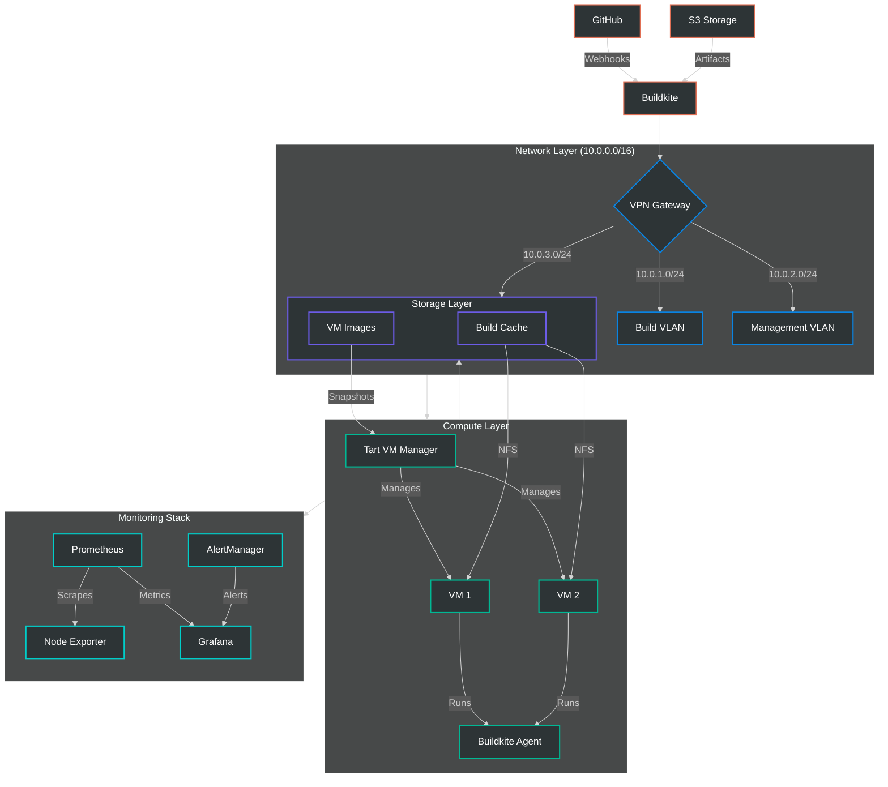

# Bun.sh CI Infrastructure

Self-hosted CI for Bun.sh builds, focused on macOS with plans for Windows/Linux. Replaces MacStadium/EC2 with local hardware.

## Infrastructure Overview



## Installation Flow

```mermaid
%%{init: {'theme': 'dark', 'themeVariables': { 'fontSize': '16px'}}}%%
graph TD
    classDef phase fill:#2d3436,stroke:#00b894,stroke-width:2px,color:#fff
    classDef component fill:#2d3436,stroke:#0984e3,stroke-width:2px,color:#fff
    classDef data fill:#2d3436,stroke:#6c5ce7,stroke-width:2px,color:#fff
    classDef service fill:#2d3436,stroke:#00cec9,stroke-width:2px,color:#fff

    %% Installation Phase
    Start[Start Installation] --> Curl[curl downloads setup script]
    Curl --> Sudo[sudo -E runs script]
    Sudo --> CheckRoot{Check root access}
    CheckRoot -->|No| Error[Exit with error]
    CheckRoot -->|Yes| Prompt[Interactive prompts]
    class Start,Curl,Sudo,CheckRoot,Error,Prompt phase

    %% Configuration Phase
    Prompt --> |Required| BuildkiteToken[Buildkite Token]
    Prompt --> |Required| GrafanaPass[Grafana Password]
    Prompt --> |Choose| VPNType{VPN Type}
    class BuildkiteToken,GrafanaPass data

    VPNType -->|WireGuard| WG[WireGuard Setup]
    VPNType -->|Tailscale| TS[Tailscale Setup]
    VPNType -->|UniFi| UV[UniFi VPN Setup]
    class VPNType phase
    class WG,TS,UV component

    %% Installation Phase
    WG & TS & UV --> InstallCore[Install Core Components]
    InstallCore --> |Homebrew| CoreDeps[Core Dependencies]
    CoreDeps --> Components[Components Setup]
    class InstallCore,CoreDeps phase

    %% Component Setup
    Components --> Tart[Tart VM Manager]
    Components --> BA[Buildkite Agent]
    Components --> Prom[Prometheus]
    Components --> Graf[Grafana]
    class Components phase
    class Tart,BA,Prom,Graf service

    %% Service Configuration
    Tart --> |VM Images| VMDir[/opt/tart/images]
    BA --> |Config| BAConfig[/opt/buildkite-agent]
    Prom --> |Metrics| PromConfig[/opt/prometheus]
    Graf --> |Dashboard| GrafConfig[/opt/grafana]
    class VMDir,BAConfig,PromConfig,GrafConfig data

    %% Service Start
    VMDir & BAConfig & PromConfig & GrafConfig --> StartServices[Start Services]
    StartServices --> |LaunchD| Running[Services Running]
    class StartServices,Running phase

    %% Final Steps
    Running --> Complete[Setup Complete]
    Complete --> NextSteps[Display Next Steps]
    class Complete,NextSteps phase
```

## Quick Install

One command to set up everything:
```bash
curl -fsSL https://raw.githubusercontent.com/oven-sh/bun/main/infrastructure/setup/setup-mac-server.sh | sudo -E bash
```

The script will:
1. Prompt for required information
2. Install and configure all services
3. Set up your chosen VPN type
4. Start everything automatically

You can also pre-set environment variables to skip prompts:
```bash
export BUILDKITE_AGENT_TOKEN="your-token"
export GRAFANA_ADMIN_PASSWORD="your-password"
export VPN_TYPE="wireguard"  # or "tailscale" or "unifi"

# Then run the installer
curl -fsSL https://raw.githubusercontent.com/oven-sh/bun/main/infrastructure/setup/setup-mac-server.sh | sudo -E bash
```

For manual installation and more control, see the detailed setup below.

## Prerequisites

### Hardware Requirements
- Mac Mini M2/M3 for ARM64 builds (32GB RAM, 1TB SSD recommended)
- Mac Mini Intel for x64 builds (32GB RAM, 1TB SSD recommended)
- UniFi Dream Machine Pro + Switch 24 PoE
- APC Smart PDU for remote power management
- UPS for clean power

### Software Requirements
- macOS 13.0 or later
- Command Line Tools for Xcode
- Homebrew package manager
- Git
- Admin access on the Mac

### Required Accounts/Access
- Buildkite account with agent token
- GitHub access to Bun.sh repository
- AWS account for S3 artifact storage (optional)

## Initial Setup

1. Clone this repository:
```bash
git clone https://github.com/oven-sh/bun.git
cd bun/infrastructure/setup
```

2. Run the setup script:
```bash
sudo -E ./setup-mac-server.sh
```

The script will interactively prompt for any required information if not provided as environment variables. You can optionally pre-set these values:
```bash
# These will be prompted for if not set
export BUILDKITE_AGENT_TOKEN="your-token"
export GRAFANA_ADMIN_PASSWORD="your-password"

# These have defaults but can be customized
export VPN_TYPE="wireguard"  # or "unifi"
export BUILD_VLAN="10.0.1.0/24"
export MGMT_VLAN="10.0.2.0/24"
export STORAGE_VLAN="10.0.3.0/24"
```

3. Follow the interactive prompts to complete the setup.

4. Verify installation:
```bash
# Check Buildkite agent (if installed)
buildkite-agent status

# Check Tart
tart list

# Check monitoring (if configured)
curl localhost:9090  # Prometheus
curl localhost:3000  # Grafana
```

## Network Configuration

### VLAN Setup
- Build VLAN: 10.0.1.0/24 (VM traffic)
- Management: 10.0.2.0/24 (monitoring, admin)
- Storage: 10.0.3.0/24 (NFS, caches)

### Required Firewall Rules
```
# External Access
ALLOW tcp/443 github.com          # Git operations
ALLOW tcp/443 api.buildkite.com   # CI coordination
ALLOW tcp/443 s3.amazonaws.com    # Artifact storage
ALLOW udp/51820 vpn-endpoint      # Remote access

# Internal Access (within VLAN)
ALLOW tcp/9090 prometheus         # Metrics
ALLOW tcp/3000 grafana           # Monitoring UI
ALLOW tcp/2049 nfs               # Build cache
```

## VM Management

### Configuration
Each host runs maximum 2 VMs with:
- 4 CPU cores per VM
- 8GB RAM per VM
- 50GB disk per VM
- Clean snapshot per build

### Common VM Commands
```bash
# List VMs
tart list

# Create new VM
tart create --from-ci-template my-build-vm

# Start VM
tart run my-build-vm

# Delete VM
tart delete my-build-vm

# Create snapshot
tart snapshot create my-build-vm base-state
```

## Security Setup

### Access Control
- SSH key-based authentication only
- MFA required for all admin access
- Just-in-Time (JIT) access for maintenance
- Full audit logging enabled

### Key Management
```bash
# Generate new SSH key
ssh-keygen -t ed25519 -C "ci-host-$(date +%Y%m)"

# Add to authorized keys
cat ~/.ssh/id_ed25519.pub >> ~/.ssh/authorized_keys

# Rotate keys (monthly)
mv ~/.ssh/authorized_keys ~/.ssh/authorized_keys.old
# Add new keys before removing old ones
```

## Monitoring Setup

### Key Metrics
- Build duration and success rate
- Queue length and wait time
- VM resource usage (CPU, RAM, disk)
- Network throughput
- Cache hit rates

### Alert Thresholds
- CPU usage > 90% for 5 minutes
- Memory usage > 85% for 5 minutes
- Disk usage > 90%
- Build queue > 10 jobs
- Failed builds > 5 per hour

### Accessing Metrics
- Grafana: http://localhost:3000 (default admin/your-password)
- Prometheus: http://localhost:9090
- Node Exporter metrics: http://localhost:9100/metrics

## Post-Installation Setup

### 1. Accessing Services

#### Grafana Monitoring
- URL: http://localhost:3000 (or http://your-server-ip:3000)
- Default login: admin / (password you provided during setup)
- Default dashboards are automatically configured for:
  - Build metrics
  - System resources
  - Network status
  - Cache performance

#### Buildkite Integration
1. Your agent should automatically connect to Buildkite
2. Verify in Buildkite UI: Settings → Agents
3. Tag your agent in Buildkite for specific architectures:
   ```bash
   # Edit /etc/buildkite-agent/buildkite-agent.cfg
   tags="arch=arm64,os=macos,chip=m2"
   ```

#### Remote Access

The setup supports three VPN options:

1. **WireGuard (Default)**
   - Simple point-to-point VPN
   - Lightweight and fast
   - Built-in to modern operating systems
   - Configuration file provided at `/etc/wireguard/client.conf`
   ```bash
   # View WireGuard config
   sudo cat /etc/wireguard/wg0.conf
   # Check connection
   sudo wg show
   ```

2. **Tailscale**
   - Zero-trust mesh networking
   - Easy NAT traversal
   - Automatic key management
   - Optional SSO integration
   ```bash
   # Check Tailscale status
   tailscale status
   # Get connection details
   tailscale netcheck
   ```

3. **UniFi VPN**
   - Integrated with UniFi Dream Machine Pro
   - Managed through UniFi Controller
   - Better for teams already using UniFi infrastructure
   - Configuration stored in `/etc/openvpn/unifi.ovpn`
   ```bash
   # Check UniFi VPN status
   sudo openvpn --status
   # View connection log
   tail -f /var/log/openvpn.log
   ```

To connect:
```bash
# For WireGuard
# 1. Install WireGuard client for your OS
# 2. Copy the config: sudo cat /etc/wireguard/wg0.conf
# 3. Import into your WireGuard client

# For Tailscale
# 1. Install Tailscale client
# 2. Run: tailscale up
# 3. Follow browser authentication

# For UniFi VPN
# 1. Install OpenVPN client
# 2. Copy the config: sudo cat /etc/openvpn/unifi.ovpn
# 3. Import into your OpenVPN client
```

Note: Previous references to Tailscale have been removed as it's not currently implemented. If you need a mesh VPN solution, you can set up Tailscale separately after installation.

SSH Access:
```bash
# Your SSH key was automatically added during setup
ssh ci-admin@your-server-ip

# For additional users
sudo ci-admin add-user username
```

### 2. Verifying Setup

Check all services are running:
```bash
# Check service status
sudo ci-admin status

# View all running services
sudo ci-admin list-services

# Check connectivity
sudo ci-admin test-connection
```

### 3. Initial Configuration

1. Set up build environments:
```bash
# Create base VM image
sudo ci-admin create-base-image

# Test build environment
sudo ci-admin test-build
```

2. Configure monitoring alerts:
```bash
# Access Grafana
open http://localhost:3000

# Default alerts are in:
# - High CPU/Memory usage
# - Build failures
# - Network issues
# - Disk space
```

3. Set up backup schedule:
```bash
# Configure backup location
sudo ci-admin configure-backup s3://your-bucket

# Enable automatic backups
sudo ci-admin enable-backup
```

### 4. Next Steps

1. Set up your first build pipeline:
   - Example pipeline in `.buildkite/pipeline.yml`
   - Test with: `buildkite-agent pipeline upload`

2. Configure artifact storage:
   ```bash
   # Local storage
   sudo ci-admin configure-storage local

   # Or S3
   sudo ci-admin configure-storage s3 your-bucket
   ```

3. Set up monitoring notifications:
   - Grafana → Alerting → Notification channels
   - Add Slack/Email/PagerDuty

## Maintenance and Updates

### Updating the System
```bash
# Update all components
sudo ci-admin update

# Update specific component
sudo ci-admin update [buildkite|tart|monitoring]
```

### Backup and Restore
```bash
# Manual backup
sudo ci-admin backup

# List backups
sudo ci-admin list-backups

# Restore from backup
sudo ci-admin restore backup-name
```

### Adding More Capacity
```bash
# Add another build agent
sudo ci-admin add-agent

# Add storage
sudo ci-admin extend-storage 500G
```

## Troubleshooting

### Common Issues

1. Build Agent Not Connecting
```bash
# Check agent status
sudo ci-admin check-agent

# View agent logs
sudo ci-admin logs buildkite
```

2. Monitoring Not Working
```bash
# Reset Grafana password
sudo ci-admin reset-grafana-password

# Check Prometheus targets
curl localhost:9090/targets
```

3. VM Issues
```bash
# Clean up stuck VMs
sudo ci-admin cleanup-vms

# Reset VM state
sudo ci-admin reset-vm vm-name
```

## Cost Analysis

### Hardware Costs (One-time)
- M2/M3 Mac Mini: $1,200
- Intel Mac Mini: $800
- Network Stack: $1,500
- UPS & PDU: $500
Total: ~$4,000

### Monthly Operating Costs
- Power: $50
- Internet: $100
- S3 Storage: $20
- Maintenance: $100
Total: ~$270/month

Compared to cloud services:
- MacStadium: ~$1,000/month
- EC2: ~$500/month
Net savings: ~$1,200/month
ROI: ~3.5 months

## Support

For issues or questions:
- Email: sam@buildarchetype.dev
- Internal Slack: #ci-infrastructure
- Emergency: See on-call rotation in PagerDuty